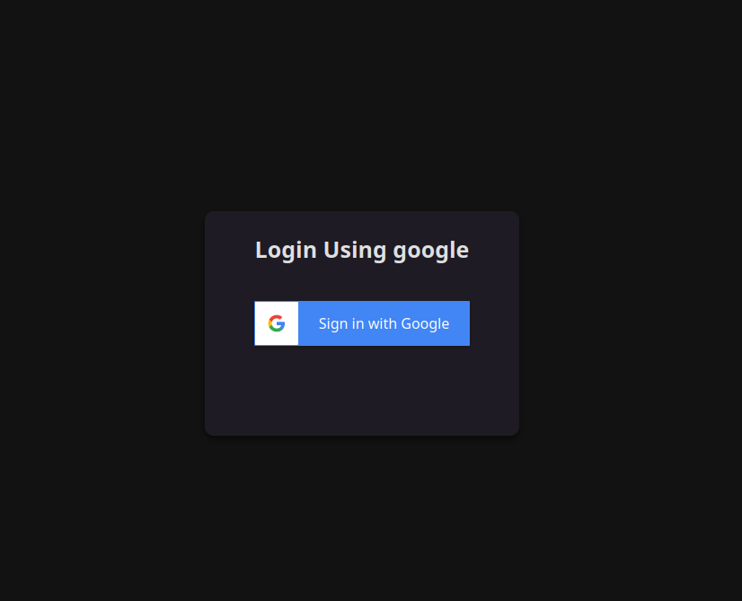
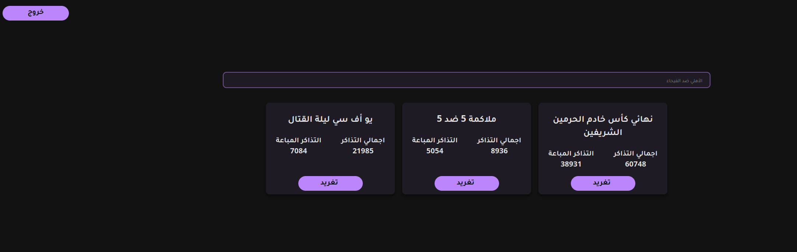
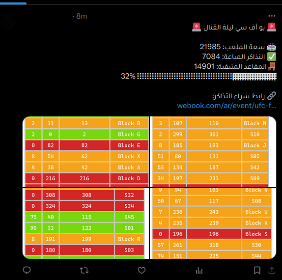

# Tickets Counter
This React project is like a window to control a Twitter bot I made before. The bot's job is to find events and see how many tickets are sold on webook.com. With this project, I can easily use the bot from anywhere, making it super convenient to tweet about ticket sales no matter where I am.

